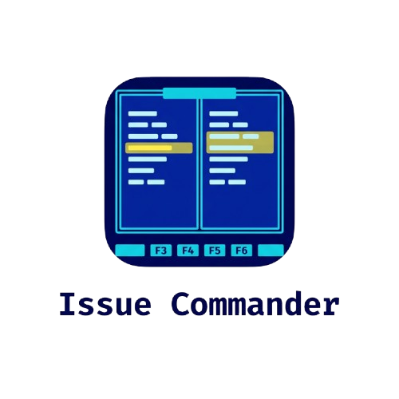
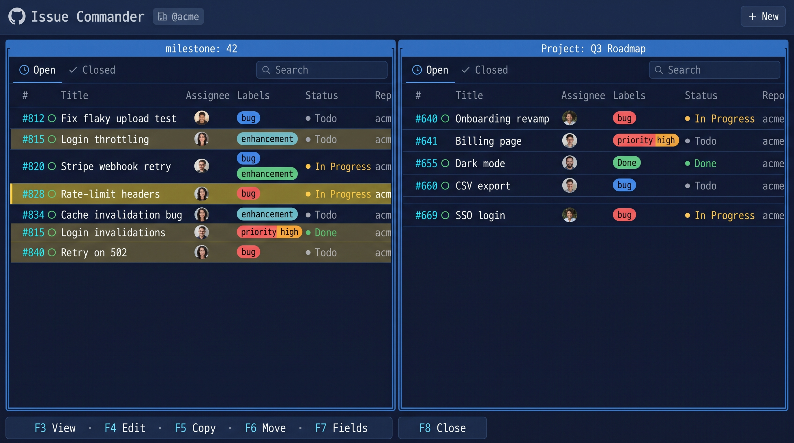

<p align="center">
  
</p>

# Issue Commander

**A two-pane manager for GitHub issues and pull requests**, in the tradition of the
[orthodox file managers](https://en.wikipedia.org/wiki/Orthodox_file_manager) — Norton Commander,
Total Commander, and Midnight Commander (`mc`). Point each pane at a
**repository**, an **org-wide milestone**, or a **GitHub Project (V2)**, then triage with function
keys (F3–F8) — the way you move files in a two-pane file manager. Everything stays scoped to one
GitHub **organization**.

```bash
GITHUB_ORG=your-org npx issue-commander
# → http://localhost:3000
```

<p align="center">
  
</p>

---

## Why

GitHub shows one issue, in one repo, in one tab. Triaging across repos, a milestone, or a project
board means constant clicking and context-switching. Issue Commander puts two panes side by side and
drives every action from the keyboard, so you reorganize issues as fast as you move files in a
two-pane file manager.

## Requirements

- **Node 20+**
- **[GitHub CLI](https://cli.github.com/), authenticated.** The token comes from `gh auth token`
  (falling back to `GITHUB_TOKEN` / `GH_TOKEN`); run `gh auth login` once. It needs the `repo`,
  `read:org`, and `project` scopes.
- **`GITHUB_ORG`** — the organization to manage. There is no in-app org switch.

```bash
gh auth login
GITHUB_ORG=acme npx issue-commander             # default port 3000
PORT=3002 GITHUB_ORG=acme npx issue-commander   # custom port
```

## The two panes

Each pane points at a **source** and lists its rows in a dense, resizable table. You act **from** the
active pane **onto** the other one: put the cursor on a row, press a function key, and it operates on
whatever the opposite pane shows. Press **F6** on the left pane to move that issue into the right
pane's project:

| 🏁&nbsp; `milestone: 42` · **F1**  | 📋&nbsp; `Project: Q3 Roadmap` · **F2**    |
| ---------------------------------- | ------------------------------------------ |
| `#812  Fix flaky upload test`      | `#640  Onboarding revamp    ● Todo`        |
| `#815  Login throttling`  ◀ cursor | `#641  Billing page         ● In Progress` |
| `#820  Stripe webhook retry`       | `#655  Dark mode            ● Done`        |
| `#828  Rate-limit headers`         | `#660  CSV export           ● Todo`        |

### Sources a pane can show

| Source         | What it lists                                                        | Last column |
| -------------- | -------------------------------------------------------------------- | ----------- |
| **Repository** | Issues (or pull requests) in one repo, via REST                      | Milestone   |
| **Milestone**  | Issues with that milestone **title across every repo**, via Search   | Repo        |
| **Project**    | Items on a Projects V2 board, with their **Status**, via GraphQL     | Repo        |
| **Recent**     | Issues you're involved in, most-recently-updated first, via Search   | Repo        |

### Issues or pull requests

A repository pane carries an **Issues / Pull Requests** tab. Switch to pull requests and each row
shows its **author**, **target branch**, and **merge status** — open, merged, or closed, marked by
the row icon. Filter by state (**Open / Merged / Closed / All**), by **merge date** (today, this
week, this month), by **target branch**, or by author. Pull-request rows are read-only here: open one
on GitHub with `Enter`, or preview it with `F3`.

### Columns in the issue view

| Column               | Notes                                                                         |
| -------------------- | ----------------------------------------------------------------------------- |
| **#**                | Issue number and open/closed icon; click any header to **sort**               |
| **Title**            | Double-click to open the issue on GitHub                                       |
| **Assignee**         | Overlapping avatar stack, with a `+N` overflow                                 |
| **Labels**           | GitHub colors, with a `+N` overflow                                            |
| **Status**           | The issue's **Project Status** (Todo / In Progress / Done …); see note         |
| **Repo / Milestone** | Contextual last column, set by the source                                      |

> **Status on every pane.** Project panes read Status from the board. Repository, milestone, and
> recent panes get it from a batched GraphQL lookup, so each issue shows its Project Status even when
> the pane is not a project. The **default project** you pick in Settings decides which board it reads.

## What you can do

**Move issues between milestones.** Point the left pane at `milestone: 42` and the right at
`milestone: 43`, highlight an issue, and press **F6**. It moves to milestone 43 and leaves the left
pane. Milestones match **org-wide by title**, so this works across every repo.

**Copy or move between projects.** Point one pane at a Projects V2 board. **F5** copies the
highlighted issue onto that board (an issue can belong to many projects); **F6** moves it between
boards, adding it to the target before removing it from the source, so membership is never lost. A
cross-repo move runs a real `transferIssue` — new number, old URL redirects — behind a confirm dialog.

**Act on many at once.** **Ins** marks a row (yellow) and advances the cursor, so `Ins Ins Ins`
selects a run. Then **F5 / F6 / F8** (copy / move / close) or **F7** (edit state, assignee, labels,
milestone, status, type) act on the whole selection — concurrency-limited and optimistic, with a
per-row spinner and per-row rollback on failure.

**Create and preview fast.** **Alt+Enter** opens a new-issue form in the sibling pane, pre-filled
from the active pane's source and your saved defaults. **F3** previews the highlighted row in the
opposite pane (see below). **Ctrl+U** opens an inline assignee picker on the row itself.

**Load lazily.** Lists page in on demand and background-preload the next page every few seconds until
fully loaded, keeping the previous rows on screen so a pane never flashes empty. The preview
prefetches the cursor's ticket so it opens instantly, and option lists (assignees, labels, projects)
persist in `localStorage`.

## Preview (F3)

**F3** previews the highlighted row in the opposite pane and follows the cursor. For an **issue** you
get the rendered Markdown description (images included), the comments, and its parent, sub-issues, and
linked pull requests. For a **pull request** you also get its stats — commits, changed files,
additions and deletions, and the branch flow — with no code diff.

Any issue or pull request linked by URL in the body or comments appears under **Mentioned Issues**.
Every related row — parent, sub-issue, linked, or mentioned — expands inline from its chevron to
reveal that ticket's full description, without leaving the pane or opening a dialog.

## Keyboard

| Key                 | Action                                                                |
| ------------------- | --------------------------------------------------------------------- |
| `Tab`               | Switch the active pane                                                 |
| `↑ ↓` · `PgUp/PgDn` | Move the cursor (±1 / ±10)                                             |
| `Enter`             | Open the row on GitHub                                                 |
| `Ins`               | Select the row and advance                                            |
| `F1` / `F2`         | Choose the source for the left / right pane                           |
| `F3`                | Preview in the other pane                                             |
| `F4`                | Edit the description inline, in the other pane                        |
| `F5`                | Copy to the other pane's project                                      |
| `F6`                | Move to the other pane's source                                       |
| `F7` / `Space`      | Edit fields (state, assignee, labels, milestone, status, type)        |
| `F8`                | Close the issue(s)                                                    |
| `Ctrl+U`            | Quick-assign on the highlighted row                                  |
| `Alt+Enter`         | New issue, in the sibling pane                                        |
| `Esc`               | Close the preview or dialog                                           |

Every write is **optimistic**: the UI updates at once and rolls back with a toast if the call fails.

## Settings

The **⚙** button stores your **default repository, milestone, and project** in `localStorage`. These
pre-fill new issues and choose which board's **Status** you see and edit across non-project panes.

## Development

```bash
git clone … && cd issue-commander
pnpm install
echo "GITHUB_ORG=your-org" > .env.local
pnpm dev                 # webpack dev server on :3002
pnpm build && pnpm start
pnpm lint
pnpm exec tsc --noEmit
```

> `pnpm dev` runs `next dev --webpack` **on purpose**. Next 16's Turbopack dev hot-reloader leaks an
> async-hooks map and crashes under heavy octokit churn; `build` and `start` are unaffected.

Built with Next.js 16 (App Router), React Query, Zustand, Tailwind v4, shadcn/ui, Base UI, and octokit
(REST + GraphQL). See [`CLAUDE.md`](./CLAUDE.md) for the full architecture.

## License

MIT
